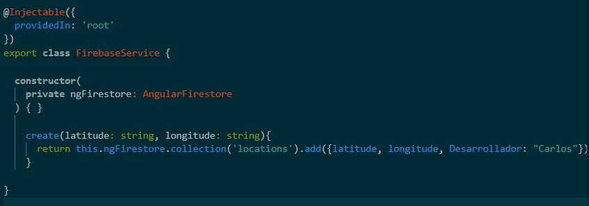
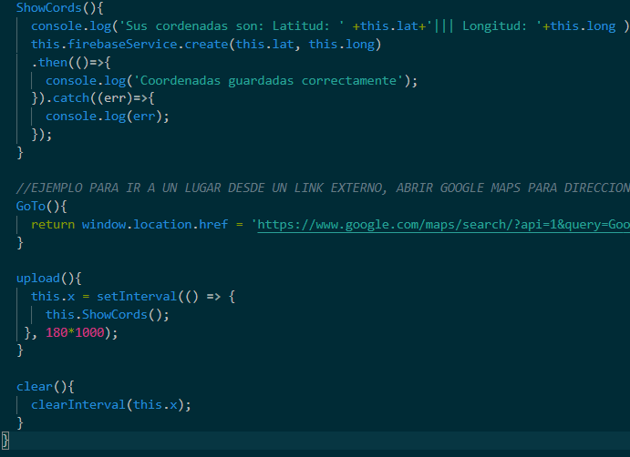

# SUPLETORIO APP MOVILES

 video aplicacion funcional 
 https://www.youtube.com/watch?v=sugeHu4Di48

 para encontrar la apk se encuentra a app-debug.apk dentro de la reiz del proyecto 
 
Aplicación con ionic que envía longitud y latitud a firevase con ayuda de googlemaps para guardar ubicación actual de un usuario

dentro de service es donde se va a definir los parametros que se enviaran a la base de datos.

para lograr repetir la aciion de la funcion cada tres minutos es necesario implementar dos funciones dentro de home.page.ts la primera llama a la funcion que hara la acion de extraer y guardas en la base de datos.

y la otra hace la acion de replicar la accion una y otra ves.

la acion una vez iniciada no tiene un metodo para detenerce por lo que debe reiniciarce el proyecto o apagar el host.

es importante cambiar las apikey de googlemaps y firebase dentro de index.html y environtmes para que el proyecto pueda cambiar ya que las claves por seguridad han sido desabilitadas

